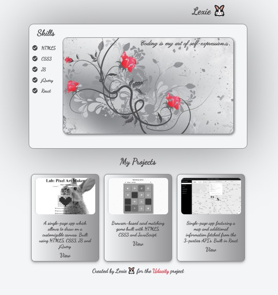
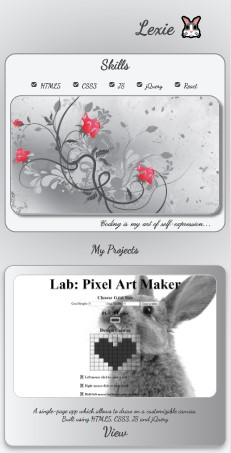

# portfolio-website-responsive

Simple portfolio web-page (HTML5, CSS3) with the links to some of my projects. The web-page is optimized across different viewport sizes via using flex-box, media-queries and responsive images.

You can access it here https://lexie14.github.io/portfolio-website-responsive/
